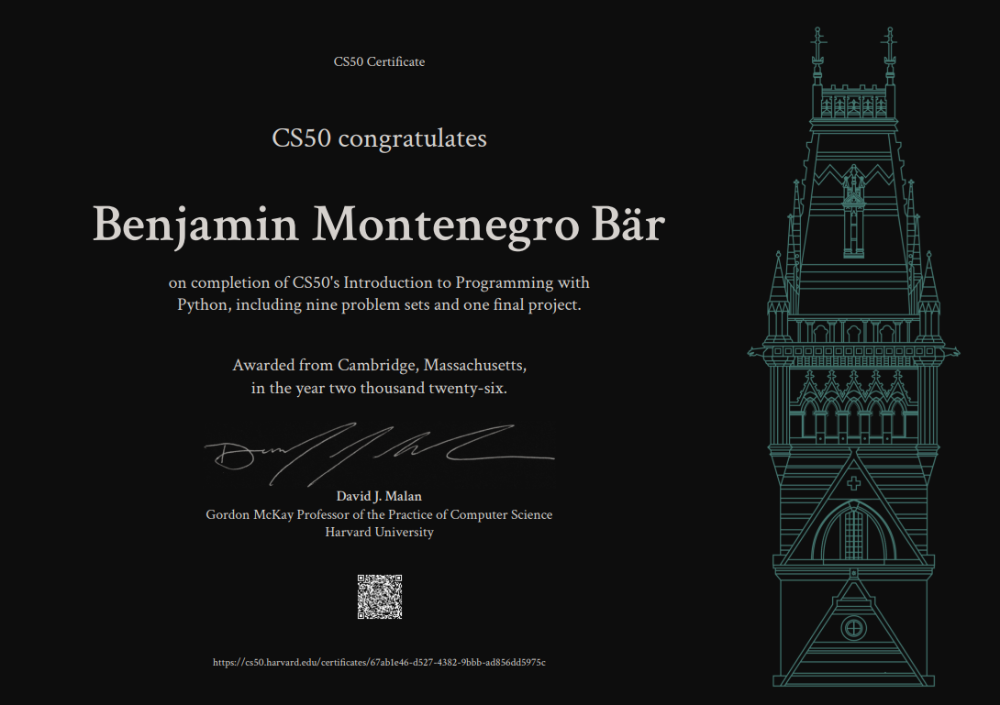

# CS50P: Introduction to Programming with Python #

Welcome to my repository! I allready finished Harvard's CS50P! (Introduction to Programming with Python)**. 
This space was dedicated to my progress, logic experiments, and personal projects as I work toward becoming a Backend Developer.

## 🚀 Progress
- [x] **Week 0:** Functions, Variables
- [x] **Week 1:** Conditionals
- [x] **Week 2:** Loops
- [x] **Week 3:** Exceptions
- [x] **Week 4:** Libraries
- [x] **Week 5:** Unit Tests
- [x] **Week 6:** File I/O
- [x] **Week 7:** Regular Expressions
- [x] **Week 8:** Object-Oriented Programming
- [x] **Week 9:** Final Project 🎓

---
## 📝 Certificate

  

---

## 📬 Connect with me!

---
> ⚠️Important: This is not a repository for responses or any solutions of the course, it is just dedicated to my personal projects while doing CS50P.
